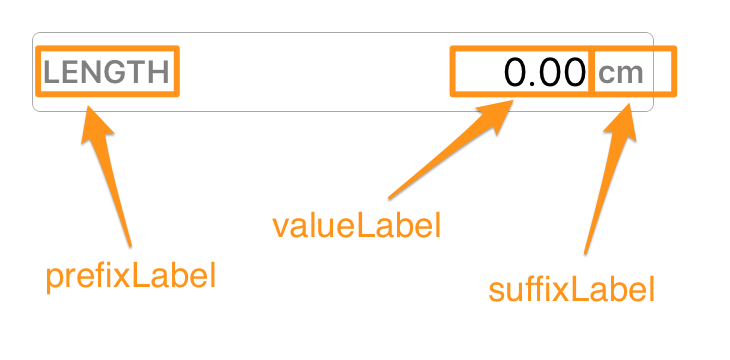

# NumberField

[](http://cocoapods.org/pods/NumberField)
[](http://cocoapods.org/pods/NumberField)
[](http://cocoapods.org/pods/NumberField)
[](http://cocoapods.org/pods/NumberField)


## Requirements

iOS 9.0 or above

## Installation

#### CocoaPods

NumberField is available through [CocoaPods](http://cocoapods.org). To install
it, simply add the following line to your Podfile:

```ruby
pod "NumberField"
```

## Usage

**Programmatically**<br>

```swift
// Create NumberField instance
let numberField = NumberField()
numberField.maxValue = 99999.99
numberField.decimalPlace = 2
numberField.prefixLabel.text = "LENGTH"
numberField.suffixLabel.text = "cm"
addSubview(numberField)

// Set value
numberField.value = 123.45

// Get value
let sellingPrice = numberField.value
```

**Storyboard**<br>

1. Drag an UIView into Storyboard.
2. Set class to **NumberField**.


## NumberField Properties

| Parameter                    | Type                 | Description                              | Default  |
| ---------------------------- | -------------------- | ---------------------------------------- | -------- |
| *value*                      | Double               | Current value.                           | 0        |
| *maxValue*                   | Double               | Maximum value. 0 means no limit.         | *0*      |
| *decimalPlace*               | Int                  | Number of decimal places. 0 means integer. | *0*      |
| *valueLabel*                 | UILabel              | UILabel showing the value text.          | *-*      |
| *prefixLabel*                | UILabel              | UILabel on the left side of value text.  | *-*      |
| *suffixLabel*                | UILabel              | UILabel on the right side of value text. | *-*      |
| *textAlignment*              | NumberFieldAlignment | Value text alignment. (.left / .right)   | *.right* |
| *isPrefndSuffixStickToSides* | Bool                 | **True** - Prefix and suffix will stick to left and right side.<br>**False** - Prefix and suffix will stick to the value text and will move as the value text size change. | *true*   |


## Basic Components

**NumberField** is constructed with **3 UILabel**. You can customize them as you like:



```swift
// Customize value label
numberField.valueLabel.font = UIFont.systemFont(ofSize: 20)

// customize prefix label
numberField.prefixLabel.text = "LENGTH"
numberField1.prefixLabel.font = UIFont.boldSystemFont(ofSize: 16)
numberField1.prefixLabel.textColor = UIColor.gray

// customize suffix label
numberField.suffixLabel.text = "cm"
numberField1.suffixLabel.font = UIFont.boldSystemFont(ofSize: 16)
numberField1.suffixLabel.textColor = UIColor.gray
```


## Keyboard Customization

| Parameter                   | Type    | Description                              | Default |
| --------------------------- | ------- | ---------------------------------------- | ------- |
| *keyboardHeight*            | CGFloat | Keyboard Height.                         | *260*   |
| *keyboardBorderColor*       | UIColor | Border line color between keyboard buttons. | *-*     |
| *keyboardTextColor*         | UIColor | Text color of keyboard buttons.          | *-*     |
| *keyboardBackgroundColor*   | UIColor | Background color of keyboard buttons.    | *-*     |
| *keyboardDecimalPlaceColor* | UIColor | Background color of decimal place button. | *-*     |
| *keyboardBackspaceColor*    | UIColor | Background color of backspace button.    | *-*     |

## 

## Events

Listen to **4 UIControlEvents**: `editingDidBegin`, `editingDidEnd`, `editingChanged` or `editingRejected`.

```swift
//Listen to editing begin:
numberField.addTarget(self, action: #selector(numberFieldEditingDidBegin), for: .editingDidBegin)

//Listen editing end:
numberField.addTarget(self, action: #selector(numberFieldEditingDidEnd), for: .editingDidEnd)

//Listen to value changed on edit.
numberField.addTarget(self, action: #selector(numberFieldEditingChanged), for: .editingChanged)

//Listen to value rejected on edit. i.e. Value exceeded maximum value.
numberField.addTarget(self, action: #selector(numberFieldEditingRejected), for: .editingRejected)

//Your functions:
func numberFieldEditingDidBegin(numberField: NumberField) { ... }
func numberFieldEditingDidEnd(numberField: NumberField) { ... }
func numberFieldEditingChanged(numberField: NumberField) { ... }
func numberFieldEditingRejected(numberField: NumberField) { ... }
```


## Author

Kenneth Tsang, kenneth.tsang@me.com

## License

NumberField is available under the MIT license. See the LICENSE file for more info.
